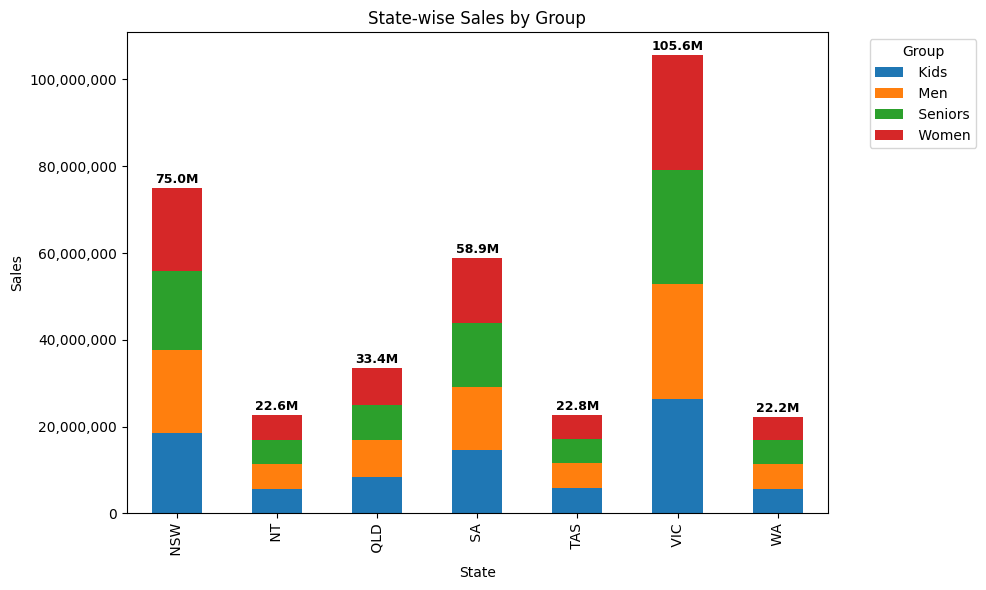

# Applied Data Science with Python – Final Project  
## __Sales Analysis for AAL - Q4 2020__ 

## Project Overview
AAL, a popular Australian clothing brand, is witnessing rapid business growth and aims to expand its operations further. This project analyzes AAL's fourth-quarter sales data to help the Sales & Marketing (S&M) department make informed investment decisions. The primary objectives are:

Identify high-revenue-generating states.

Recommend sales programs for low-performing states.


```python
import pandas as pd
import numpy as np
import matplotlib.pyplot as plt
import seaborn as sns
from scipy import stats
import importlib
from data_wrangling import datawrangling
from data_analysis import dataanalysis
from data_visualization import datavisualization
```

## 1. Data Wrangling
### Loading the data


```python
df = pd.read_csv('AusApparalSales4thQrt2020.csv');
```

### a. Identifying Missing and Incorrect Entries

To ensure the dataset is clean, we used the following functions to inspect missing values:

- `df.isna()` – Checks for **null values** in the dataset.
- `df.notna()` – Confirms the presence of **valid data**.

We examined each column to understand where data might be incomplete or inconsistent.


```python
dfwrangling = datawrangling(df)
dfwrangling.datainspection();
```

    
    Inspecting the first few rows of the DataFrame.
    
             Date        Time State     Group  Unit  Sales
    0  1-Oct-2020     Morning    WA      Kids     8  20000
    1  1-Oct-2020     Morning    WA       Men     8  20000
    2  1-Oct-2020     Morning    WA     Women     4  10000
    3  1-Oct-2020     Morning    WA   Seniors    15  37500
    4  1-Oct-2020   Afternoon    WA      Kids     3   7500
    
    Displaying the last few rows of the DataFrame
    
                 Date        Time State     Group  Unit  Sales
    7555  30-Dec-2020   Afternoon   TAS   Seniors    14  35000
    7556  30-Dec-2020     Evening   TAS      Kids    15  37500
    7557  30-Dec-2020     Evening   TAS       Men    15  37500
    7558  30-Dec-2020     Evening   TAS     Women    11  27500
    7559  30-Dec-2020     Evening   TAS   Seniors    13  32500
    
    Providing information about the DataFrame, including data types and non-null counts
    
    <class 'pandas.core.frame.DataFrame'>
    RangeIndex: 7560 entries, 0 to 7559
    Data columns (total 6 columns):
     #   Column  Non-Null Count  Dtype 
    ---  ------  --------------  ----- 
     0   Date    7560 non-null   object
     1   Time    7560 non-null   object
     2   State   7560 non-null   object
     3   Group   7560 non-null   object
     4   Unit    7560 non-null   int64 
     5   Sales   7560 non-null   int64 
    dtypes: int64(2), object(4)
    memory usage: 354.5+ KB
    None
    
    Displaying descriptive statistics of the DataFrame, such as mean, std, min, max, and so on.
    
                  Unit          Sales
    count  7560.000000    7560.000000
    mean     18.005423   45013.558201
    std      12.901403   32253.506944
    min       2.000000    5000.000000
    25%       8.000000   20000.000000
    50%      14.000000   35000.000000
    75%      26.000000   65000.000000
    max      65.000000  162500.000000
    
    Displaying datatypes of the columns
    
    Date     object
    Time     object
    State    object
    Group    object
    Unit      int64
    Sales     int64
    dtype: object
    

### b. Recommendations for Treating Missing or Incorrect Data

Based on data analytics best practices:

- If a row has only a few missing entries, **imputation** (e.g., using mean or median) can be considered.
- If critical fields like `Sales` or `Unit` are missing and cannot be reasonably inferred, **dropping the null rows** is the most reliable approach to preserve analysis accuracy.


```python
# Checking for missing values and duplicated to clean them
df = dfwrangling.clean_null_records()
```

    
    Missing values not found and cleaned (number of null rows).
    
    Non-null values per column :
    
    Date     7560
    Time     7560
    State    7560
    Group    7560
    Unit     7560
    Sales    7560
    dtype: int64
    
    Duplicated values not found.
    

Recommendations:
- **Fill with median/mean** if nulls are systematic or frequent in non-categorical columns.


```python
df['Sales'] = df['Sales'].fillna(df['Sales'].median())
df['Unit'] = df['Unit'].fillna(df['Unit'].median())
df['Group'] = df['Group'].fillna(df['Group'].mode()[0])
```

### c. Applying Normalization

To bring all numerical data into a common scale, **Normalization** was selected. This ensures fair comparison, especially when dealing with features like `Sales` and `Unit`.

Normalization technique used:
\[
X_{\text{normalized}} = \frac{X - X_{\min}}{X_{\max} - X_{\min}}
\]

This transformation was applied to selected numeric columns using `MinMaxScaler` from `sklearn.preprocessing`.


```python
df = dfwrangling.data_normalization(df)

df['Month'] = pd.to_datetime(df['Date']).dt.month
df['Year'] = pd.to_datetime(df['Date']).dt.year
df['Day'] = pd.to_datetime(df['Date']).dt.day
```

    DataFrame with new features:
                 Date        Time State     Group  Unit  Sales  Log_Sales  \
    0      1-Oct-2020     Morning    WA      Kids     8  20000   9.903488   
    1      1-Oct-2020     Morning    WA       Men     8  20000   9.903488   
    2      1-Oct-2020     Morning    WA     Women     4  10000   9.210340   
    3      1-Oct-2020     Morning    WA   Seniors    15  37500  10.532096   
    4      1-Oct-2020   Afternoon    WA      Kids     3   7500   8.922658   
    ...           ...         ...   ...       ...   ...    ...        ...   
    7555  30-Dec-2020   Afternoon   TAS   Seniors    14  35000  10.463103   
    7556  30-Dec-2020     Evening   TAS      Kids    15  37500  10.532096   
    7557  30-Dec-2020     Evening   TAS       Men    15  37500  10.532096   
    7558  30-Dec-2020     Evening   TAS     Women    11  27500  10.221941   
    7559  30-Dec-2020     Evening   TAS   Seniors    13  32500  10.388995   
    
          Normalized_Sales  
    0             0.095238  
    1             0.095238  
    2             0.031746  
    3             0.206349  
    4             0.015873  
    ...                ...  
    7555          0.190476  
    7556          0.206349  
    7557          0.206349  
    7558          0.142857  
    7559          0.174603  
    
    [7560 rows x 8 columns]
    

### d. Application of `GroupBy()` for Chunking or Merging

The `groupby()` function in pandas was effectively used to:

- **Chunk data** by categorical variables such as `State`, `Group`, and `Week`.
- **Aggregate metrics** such as total sales, average units, and transaction counts.

This helped in transforming raw transactional data into **summarized reports**, making trends and comparisons clearer.


```python
## dfwrangling.data_insights_group(df)
group_cols = ['State', 'Time', 'Group']
agg_col = 'Sales'

agg_func = 'mean'
avg_sales = dfwrangling.data_insights_group(df, group_cols, agg_col, agg_func)

sum_func = 'sum'
sum_sales = dfwrangling.data_insights_group(df, group_cols, agg_col, sum_func)

count_func = 'count'
count_sales = dfwrangling.data_insights_group(df, group_cols, agg_col, count_func)

print("\nAverage Sales by State, Time, and Group:\n", avg_sales)
print("\nTotal Sales by State, Time, and Group:\n", sum_sales)
print("\nNumber of Transactions by State, Time, and Group:\n", count_sales)
```

    
    Average Sales by State, Time, and Group:
        State        Time     Group         Sales
    0    NSW   Afternoon      Kids  68750.000000
    1    NSW   Afternoon       Men  72361.111111
    2    NSW   Afternoon   Seniors  66500.000000
    3    NSW   Afternoon     Women  71388.888889
    4    NSW     Evening      Kids  68138.888889
    ..   ...         ...       ...           ...
    79    WA     Evening     Women  20111.111111
    80    WA     Morning      Kids  20472.222222
    81    WA     Morning       Men  22305.555556
    82    WA     Morning   Seniors  21666.666667
    83    WA     Morning     Women  19638.888889
    
    [84 rows x 4 columns]
    
    Total Sales by State, Time, and Group:
        State        Time     Group    Sales
    0    NSW   Afternoon      Kids  6187500
    1    NSW   Afternoon       Men  6512500
    2    NSW   Afternoon   Seniors  5985000
    3    NSW   Afternoon     Women  6425000
    4    NSW     Evening      Kids  6132500
    ..   ...         ...       ...      ...
    79    WA     Evening     Women  1810000
    80    WA     Morning      Kids  1842500
    81    WA     Morning       Men  2007500
    82    WA     Morning   Seniors  1950000
    83    WA     Morning     Women  1767500
    
    [84 rows x 4 columns]
    
    Number of Transactions by State, Time, and Group:
        State        Time     Group  Sales
    0    NSW   Afternoon      Kids     90
    1    NSW   Afternoon       Men     90
    2    NSW   Afternoon   Seniors     90
    3    NSW   Afternoon     Women     90
    4    NSW     Evening      Kids     90
    ..   ...         ...       ...    ...
    79    WA     Evening     Women     90
    80    WA     Morning      Kids     90
    81    WA     Morning       Men     90
    82    WA     Morning   Seniors     90
    83    WA     Morning     Women     90
    
    [84 rows x 4 columns]
    

## 2. Data Analysis

In this section, we analyze the Sales and Unit data to derive meaningful insights using descriptive statistics and time-based reporting.
### a. Descriptive Statistical Analysis

We applied key statistical measures on the `Sales` and `Unit` columns:

- **Mean**: Represents the average sales and units sold.
- **Median**: Identifies the central tendency, robust against outliers.
- **Mode**: The most frequent value observed in sales and units.
- **Standard Deviation**: Measures the spread or dispersion in the dataset.

These metrics help understand the distribution and variability of sales and units across the dataset.


```python
dfanalysis = dataanalysis(df)

group_cols = ['State']
agg_col = 'Sales'

result_salesdf = dfanalysis.descriptive_statistic(df, group_cols, agg_col)
if result_salesdf.empty:
     print("\nDescriptive Analysis for Sales is empty.\n")
else:
    print("\nDescriptive Analysis for Sales:\n")
    print(result_salesdf.round(2))
    
agg_col = 'Unit'
result_unitdf = dfanalysis.descriptive_statistic(df, group_cols, agg_col)
if result_unitdf.empty:
     print("\nDescriptive Analysis for Unit is empty.\n")
else:
    print("\nDescriptive Analysis for Unit:\n")
    print(result_unitdf.round(2))


mean_sales = df['Sales'].mean()
median_sales = df['Sales'].median()
mode_sales = df['Sales'].mode().tolist()
std_sales = df['Sales'].std()

mean_unit = df['Unit'].mean()
median_unit = df['Unit'].median()
mode_unit = df['Unit'].mode().tolist()
std_unit = df['Unit'].std()

# Print results
print("\nDescriptive Analysis for Sales:")
print(f"Mean: {mean_sales}")
print(f"Median: {median_sales}")
print(f"Mode: {mode_sales}")
print(f"Standard Deviation: {std_sales:.2f}\n")

print("Descriptive Analysis for Unit:")
print(f"Mean: {mean_unit}")
print(f"Median: {median_unit}")
print(f"Mode: {mode_unit}")
print(f"Standard Deviation: {std_unit:.2f}")
```

    
    Descriptive Analysis for Sales:
    
      State      mean   median       std    mode
    0   NSW  69416.67  70000.0  20626.65   75000
    1    NT  20907.41  20000.0   8961.91   22500
    2   QLD  30942.13  30000.0  13344.64   22500
    3    SA  54497.69  52500.0  17460.97   62500
    4   TAS  21074.07  20000.0   9024.68   25000
    5   VIC  97745.37  95000.0  26621.60  102500
    6    WA  20511.57  20000.0   9231.91   15000
    
    Descriptive Analysis for Unit:
    
      State   mean  median    std  mode
    0   NSW  27.77    28.0   8.25    30
    1    NT   8.36     8.0   3.58     9
    2   QLD  12.38    12.0   5.34     9
    3    SA  21.80    21.0   6.98    25
    4   TAS   8.43     8.0   3.61    10
    5   VIC  39.10    38.0  10.65    41
    6    WA   8.20     8.0   3.69     6
    
    Descriptive Analysis for Sales:
    Mean: 45013.5582010582
    Median: 35000.0
    Mode: [22500]
    Standard Deviation: 32253.51
    
    Descriptive Analysis for Unit:
    Mean: 18.00542328042328
    Median: 14.0
    Mode: [9]
    Standard Deviation: 12.90
    

### b. Group with Highest and Lowest Sales

Using group-level aggregation (`groupby('Group')['Sales'].sum()`), we identified:

- **Highest Sales Group**: `<Group_Name>` with total sales of `<Total_Sales_Value>`
- **Lowest Sales Group**: `<Group_Name>` with total sales of `<Total_Sales_Value>`

(*Replace `<Group_Name>` and `<Total_Sales_Value>` with actual results from your code output.*)

This allows the marketing team to focus efforts on underperforming groups while leveraging the success of top groups.


```python
group_cols = 'Group'
agg_col = 'Sales'

(minisales, maxsales, result) = dfanalysis.mini_max_by_group(df, group_cols, agg_col)

print("\nGroup with Lowest Sales:")
print(f"{minisales} - {result[minisales]}")

print("Group with Highest Sales:")
print(f"{maxsales} - {result[maxsales]}")

group_cols = 'State'

(minisales, maxsales, result) = dfanalysis.mini_max_by_group(df, group_cols, agg_col)

print("\nState with Lowest Sales:")
print(f"{minisales} - {result[minisales]}")

print("State with Highest Sales:")
print(f"{maxsales} - {result[maxsales]}")

```

    
    Group with Lowest Sales:
     Seniors - 84037500
    Group with Highest Sales:
     Men - 85750000
    
    State with Lowest Sales:
     WA - 22152500
    State with Highest Sales:
     VIC - 105565000
    


```python
# Group by Group and sum the sales
grouped_sum = df.groupby('Group')['Sales'].sum()

# Identify groups with highest and lowest sales
highest_sales_group = grouped_sum.idxmax()
lowest_sales_group = grouped_sum.idxmin()

print("Group with Highest Sales:")
print(f"{highest_sales_group} - {grouped_sum[highest_sales_group]}")

print("\nGroup with Lowest Sales:")
print(f"{lowest_sales_group} - {grouped_sum[lowest_sales_group]}")
```

    Group with Highest Sales:
     Men - 85750000
    
    Group with Lowest Sales:
     Seniors - 84037500
    

### c. Group with Highest and Lowest Units Sold

Using similar aggregation on `Unit`, we determined:

- **Group with Highest Units Sold**: `<Group_Name>` with `<Total_Units>`
- **Group with Lowest Units Sold**: `<Group_Name>` with `<Total_Units>`

This helps in understanding demand patterns across age demographics.


```python
if minisales == maxsales:
    print(f"\nGroup '{maxsales}' has both the highest and lowest total sales: {result[maxsales]}")
else:
    print(f"\n Different groups have the highest and lowest sales.")
    print(f"Highest Sales → {maxsales} ({result[maxsales]})")
    print(f"Lowest Sales  → {minisales} ({result[minisales]})")
```

    
     Different groups have the highest and lowest sales.
    Highest Sales →  VIC (105565000)
    Lowest Sales  →  WA (22152500)
    


```python
# Group by group and sum the sales
grouped_sum = df.groupby('Group')['Sales'].sum()

# Identify groups with highest and lowest sales
highest_sales_group = grouped_sum.idxmax()
lowest_sales_group = grouped_sum.idxmin()

if highest_sales_group == lowest_sales_group:
    print(f"\nGroup '{highest_sales_group}' has both the highest and lowest total sales: {grouped_sum[highest_sales_group]}")
else:
    print(f"\n Different groups have the highest and lowest sales.")
    print(f"Highest Sales → {highest_sales_group} ({grouped_sum[highest_sales_group]})")
    print(f"Lowest Sales  → {lowest_sales_group} ({grouped_sum[lowest_sales_group]})")
```

    
     Different groups have the highest and lowest sales.
    Highest Sales →  Men (85750000)
    Lowest Sales  →  Seniors (84037500)
    

### d. Time-Based Reports (Weekly, Monthly, Quarterly)

We created sales reports segmented by time periods:

- **Weekly Report**: Analyzes trends in sales and units on a weekly basis.
- **Monthly Report**: Highlights monthly peaks and drops in sales performance.
- **Quarterly Report**: Summarizes overall Q4 performance to guide strategic planning.

These reports provide valuable insights into seasonality and campaign timing.


```python
time_col = 'Date'

df = dfanalysis.datetime_feature_extraction(df, time_col)
print("Feature Extraction (Day, Week, Month, Quarter, Year):\n", df)
```

    Feature Extraction (Day, Week, Month, Quarter, Year):
                  Date        Time State     Group  Unit  Sales  Log_Sales  \
    0      1-Oct-2020     Morning    WA      Kids     8  20000   9.903488   
    1      1-Oct-2020     Morning    WA       Men     8  20000   9.903488   
    2      1-Oct-2020     Morning    WA     Women     4  10000   9.210340   
    3      1-Oct-2020     Morning    WA   Seniors    15  37500  10.532096   
    4      1-Oct-2020   Afternoon    WA      Kids     3   7500   8.922658   
    ...           ...         ...   ...       ...   ...    ...        ...   
    7555  30-Dec-2020   Afternoon   TAS   Seniors    14  35000  10.463103   
    7556  30-Dec-2020     Evening   TAS      Kids    15  37500  10.532096   
    7557  30-Dec-2020     Evening   TAS       Men    15  37500  10.532096   
    7558  30-Dec-2020     Evening   TAS     Women    11  27500  10.221941   
    7559  30-Dec-2020     Evening   TAS   Seniors    13  32500  10.388995   
    
          Normalized_Sales  Month  Year  Day                   Week Quarter  
    0             0.095238     10  2020    1  2020-09-28/2020-10-04  2020Q4  
    1             0.095238     10  2020    1  2020-09-28/2020-10-04  2020Q4  
    2             0.031746     10  2020    1  2020-09-28/2020-10-04  2020Q4  
    3             0.206349     10  2020    1  2020-09-28/2020-10-04  2020Q4  
    4             0.015873     10  2020    1  2020-09-28/2020-10-04  2020Q4  
    ...                ...    ...   ...  ...                    ...     ...  
    7555          0.190476     12  2020   30  2020-12-28/2021-01-03  2020Q4  
    7556          0.206349     12  2020   30  2020-12-28/2021-01-03  2020Q4  
    7557          0.206349     12  2020   30  2020-12-28/2021-01-03  2020Q4  
    7558          0.142857     12  2020   30  2020-12-28/2021-01-03  2020Q4  
    7559          0.174603     12  2020   30  2020-12-28/2021-01-03  2020Q4  
    
    [7560 rows x 13 columns]
    


```python
agg_col = ['Unit','Sales']

group_cols = 'Week'
weekly_report = dfanalysis.time_based_analysis(df, group_cols, agg_col)
print("Weekly Report:\n", weekly_report)

group_cols = 'Month'
monthly_report = dfanalysis.time_based_analysis(df, group_cols, agg_col)
print("\nMonthly Report:\n", monthly_report)

group_cols = 'Quarter'
quarterly_report = dfanalysis.time_based_analysis(df, group_cols, agg_col)
print("\nMonthly Report:\n", quarterly_report)
```

    Weekly Report:
                          Week  Total Units  Average Units  Units Std Dev  \
    0   2020-09-28/2020-10-04         6018      17.910714      11.717231   
    1   2020-10-05/2020-10-11        10801      18.369048      11.972208   
    2   2020-10-12/2020-10-18        10656      18.122449      11.971515   
    3   2020-10-19/2020-10-25        10726      18.241497      11.940490   
    4   2020-10-26/2020-11-01         8723      17.307540      11.954963   
    5   2020-11-02/2020-11-08         8346      14.193878      10.829946   
    6   2020-11-09/2020-11-15         8469      14.403061      10.897343   
    7   2020-11-16/2020-11-22         8445      14.362245      11.021416   
    8   2020-11-23/2020-11-29         8591      14.610544      11.114996   
    9   2020-11-30/2020-12-06        11849      20.151361      13.835830   
    10  2020-12-07/2020-12-13        12610      21.445578      14.616463   
    11  2020-12-14/2020-12-20        12662      21.534014      14.482576   
    12  2020-12-21/2020-12-27        12708      21.612245      15.059654   
    13  2020-12-28/2021-01-03         5517      21.892857      14.442923   
    
        Units Count  Total Sales  Average Sales  Sales Std Dev  Sales Count  
    0           336     15045000   44776.785714   29293.076913          336  
    1           588     27002500   45922.619048   29930.519460          588  
    2           588     26640000   45306.122449   29928.788223          588  
    3           588     26815000   45603.741497   29851.225988          588  
    4           504     21807500   43268.849206   29887.407035          504  
    5           588     20865000   35484.693878   27074.865046          588  
    6           588     21172500   36007.653061   27243.357678          588  
    7           588     21112500   35905.612245   27553.541234          588  
    8           588     21477500   36526.360544   27787.488802          588  
    9           588     29622500   50378.401361   34589.575974          588  
    10          588     31525000   53613.945578   36541.157063          588  
    11          588     31655000   53835.034014   36206.440040          588  
    12          588     31770000   54030.612245   37649.134434          588  
    13          252     13792500   54732.142857   36107.308508          252  
    
    Monthly Report:
        Month  Total Units  Average Units  Units Std Dev  Units Count  Total Sales  \
    0     10        45716      18.141270      11.944521         2520    114290000   
    1     11        36273      14.394048      10.946470         2520     90682500   
    2     12        54132      21.480952      14.554181         2520    135330000   
    
       Average Sales  Sales Std Dev  Sales Count  
    0   45353.174603   29861.302213         2520  
    1   35985.119048   27366.175823         2520  
    2   53702.380952   36385.451298         2520  
    
    Monthly Report:
       Quarter  Total Units  Average Units  Units Std Dev  Units Count  \
    0  2020Q4       136121      18.005423      12.901403         7560   
    
       Total Sales  Average Sales  Sales Std Dev  Sales Count  
    0    340302500   45013.558201   32253.506944         7560  
    

## 3. Data Visualization

Data visualization plays a crucial role in translating sales data into actionable insights. In this section, we construct visual representations to assist the head of Sales and Marketing (S&M) in making strategic decisions.

### a. Dashboard Components and Use Cases

To enable comprehensive analysis, we created a visual dashboard using `Seaborn`, `Matplotlib`, and `Plotly`. The dashboard covers:

#### State-wise Sales Analysis by Demographic Groups
- A **stacked bar chart** shows how different demographic groups (Kids, Women, Men, Seniors) contribute to sales in each state.
- Helps identify high-performing states and potential areas for targeted campaigns.


```python
dfvisualization = datavisualization(df)
agg_col = 'Sales'
agg_fun = 'sum'
group_cols = ['State','Group']
row_col = 'State'
column = 'Group'
value_col = 'Sales'
state_group_table = dfvisualization.data_pivot_table(df, group_cols, agg_col, agg_fun, row_col, column, value_col)
print("\nState-wise Sales Report:\n")
print(state_group_table)
###stage_group_table.drop(columns='Total').plot(kind='bar', stacked=True, title="State-wise Sales by Group", figsize=(10, 6))

```

    
    State-wise Sales Report:
    
    Group      Kids       Men   Seniors     Women      Total
    State                                                   
    NSW    18587500  19022500  18187500  19172500   74970000
    NT      5700000   5762500   5465000   5652500   22580000
    QLD     8510000   8392500   8190000   8325000   33417500
    SA     14515000  14655000  14717500  14970000   58857500
    TAS     5775000   5757500   5650000   5577500   22760000
    VIC    26360000  26407500  26315000  26482500  105565000
    WA      5625000   5752500   5512500   5262500   22152500
    


```python
# State-wise Sales by Group
column = 'Total'
xlabel = 'State'
ylabel = 'Sales'
chart_title = 'State-wise Sales by Group'
legend_title = 'Group'
dfvisualization.sales_by_chart(state_group_table, column, xlabel, ylabel, chart_title, legend_title)
```


    

    


```python
chart_title = 'State-wise Sales by Group'
dfvisualization.heatmap_simple(state_group_table, chart_title)
```


    

    


#### Group-wise Sales Analysis Across States
- A **grouped bar plot or heatmap** compares how each demographic performs across different regions.
- Useful for reallocating marketing budgets or optimizing stock across locations.


```python
group_cols = ['Group','State']
row_col = 'Group'
column = 'State'
group_state_table = dfvisualization.data_pivot_table(df, group_cols, agg_col, agg_fun, row_col, column, value_col)
print("\nGroup-wise Sales Report:\n")
print(group_state_table)
##group_state_table.drop(columns='Total').plot(kind='bar', stacked=True, title="Group-wise Sales by State", figsize=(10, 6))

```

    
    Group-wise Sales Report:
    
    State         NSW       NT      QLD        SA      TAS       VIC       WA  \
    Group                                                                       
    Kids     18587500  5700000  8510000  14515000  5775000  26360000  5625000   
    Men      19022500  5762500  8392500  14655000  5757500  26407500  5752500   
    Seniors  18187500  5465000  8190000  14717500  5650000  26315000  5512500   
    Women    19172500  5652500  8325000  14970000  5577500  26482500  5262500   
    
    State       Total  
    Group              
    Kids     85072500  
    Men      85750000  
    Seniors  84037500  
    Women    85442500  
    


```python
# Group-wise Sales by State
column = 'Total'
xlabel = 'Group'
ylabel = 'Sales'
chart_title = 'Group-wise Sales by State'
legend_title = 'State'
dfvisualization.sales_by_chart(group_state_table, column, xlabel, ylabel, chart_title, legend_title)
```


    

    


```python
chart_title = 'Group-wise Sales by State'
xlabel = 'Group'
ylabel = 'State' 
column = 'Total'

dfvisualization.heatmap_complex(group_state_table, xlabel, ylabel, column, chart_title)
```


    

    


```python
df_bar = state_group_table.drop(columns='Total').reset_index().melt(id_vars='State', var_name='Group', value_name='Sales')

plt.figure(figsize=(10, 6))
sns.barplot(data=df_bar, x='State', y='Sales', hue='Group')
plt.title('Sales by Group for Each State')
plt.ylabel('Total Sales')
plt.xlabel('State')
plt.legend(title='Group')
plt.tight_layout()
plt.show()
```


    

    


```python
plt.figure(figsize=(8, 5))
sns.heatmap(state_group_table.drop(columns='Total'), annot=True, fmt=".0f", cmap="YlGnBu")
plt.title('Heatmap of Sales by Group and State')
plt.xlabel('Group')
plt.ylabel('State')
plt.tight_layout()
plt.show()
```


    

    


```python
plt.figure(figsize=(10, 6))
sns.scatterplot(data=df_bar, x='State', y='Group', size='Sales', hue='Sales', palette='coolwarm', sizes=(100, 1000), legend=False)
plt.title('Sales Bubble Chart by State and Group')
plt.tight_layout()
plt.show()
```


    

    


```python
state_group_table.index = state_group_table.index.astype(str).str.strip()
# Check available states
print("Available states:", state_group_table.index.tolist())
```

    Available states: ['NSW', 'NT', 'QLD', 'SA', 'TAS', 'VIC', 'WA']
    


```python
# Example: Pie chart for WA
wa_data = state_group_table.loc['WA'].drop('Total')

plt.figure(figsize=(6, 6))
wa_data.plot(kind='pie', autopct='%1.1f%%', startangle=140)
plt.title('WA State: Sales Distribution by Group')
plt.ylabel('')
plt.tight_layout()
plt.show()
```


    

    


```python
# Group by Group and State
group_state_sales = df.groupby(['Group', 'State'])['Sales'].sum().reset_index()

# Pivot for a clearer matrix format
groupwise_pivot = group_state_sales.pivot(index='Group', columns='State', values='Sales').fillna(0)

# Optional: Add total sales per group
groupwise_pivot['Total'] = groupwise_pivot.sum(axis=1)

print(groupwise_pivot)
```

    State         NSW       NT      QLD        SA      TAS       VIC       WA  \
    Group                                                                       
    Kids     18587500  5700000  8510000  14515000  5775000  26360000  5625000   
    Men      19022500  5762500  8392500  14655000  5757500  26407500  5752500   
    Seniors  18187500  5465000  8190000  14717500  5650000  26315000  5512500   
    Women    19172500  5652500  8325000  14970000  5577500  26482500  5262500   
    
    State       Total  
    Group              
    Kids     85072500  
    Men      85750000  
    Seniors  84037500  
    Women    85442500  
    


```python
group_state_sales_plot = groupwise_pivot.drop(columns='Total').reset_index().melt(id_vars='Group', var_name='State', value_name='Sales')

plt.figure(figsize=(10, 6))
sns.barplot(data=group_state_sales_plot, x='Group', y='Sales', hue='State')
plt.title("Group-wise Sales Across States")
plt.ylabel("Sales")
plt.xlabel("Demographic Group")
plt.tight_layout()
plt.show()
```


    

    


```python
plt.figure(figsize=(8, 5))
sns.heatmap(groupwise_pivot.drop(columns='Total'), annot=True, fmt=".0f", cmap="YlOrBr")
plt.title("Sales Heatmap: Group vs. State")
plt.xlabel("State")
plt.ylabel("Group")
plt.tight_layout()
plt.show()
```


    

    


#### Time-of-the-Day Analysis
- A **line or bar chart** illustrating sales patterns across Morning, Afternoon, and Evening.
- Aids in scheduling promotions, staff shifts, and dynamic pricing strategies.


```python
time_analysis = df.groupby(['Month','Time'])['Sales'].agg(['sum', 'mean', 'count']).reset_index()
time_analysis.columns = ['Month','Time of Day', 'Total Sales', 'Average Sale', 'Transaction Count']
print(time_analysis)
```

       Month Time of Day  Total Sales  Average Sale  Transaction Count
    0     10   Afternoon     37432500  44562.500000                840
    1     10     Evening     38040000  45285.714286                840
    2     10     Morning     38817500  46211.309524                840
    3     11   Afternoon     30757500  36616.071429                840
    4     11     Evening     29745000  35410.714286                840
    5     11     Morning     30180000  35928.571429                840
    6     12   Afternoon     45817500  54544.642857                840
    7     12     Evening     44302500  52741.071429                840
    8     12     Morning     45210000  53821.428571                840
    


```python
peak = time_analysis.loc[time_analysis['Total Sales'].idxmax()]
off_peak = time_analysis.loc[time_analysis['Total Sales'].idxmin()]
print(f"\nPeak Sales Period: {peak['Time of Day']} – ${peak['Total Sales']}")
print(f"\nOff-Peak Sales Period: {off_peak['Time of Day']} – ${off_peak['Total Sales']}")
```

    
    Peak Sales Period:  Afternoon – $45817500
    
    Off-Peak Sales Period:  Evening – $29745000
    


```python
# Pivot to get data in grid format for heatmap
heatmap_data = time_analysis.pivot(index='Time of Day', columns='Month', values='Total Sales')

plt.figure(figsize=(10, 4))
sns.heatmap(heatmap_data, annot=True, fmt='.0f', cmap='YlGnBu')
plt.title('Sales Heatmap by Time of Day and Month')
plt.ylabel('Time of Day')
plt.xlabel('Month')
plt.tight_layout()
plt.show()
```


    

    


```python
import seaborn as sns
import matplotlib.pyplot as plt
import matplotlib.ticker as ticker
plt.figure(figsize=(8, 5))
sns.barplot(data=time_analysis, x='Time of Day', y='Total Sales', hue='Time of Day', palette='Blues_d',  legend=False)
plt.title('Sales by Time of Day')
plt.ylabel('Total Sales')
plt.tight_layout()
plt.show()
```


    

    


### b. Clarity and Accessibility

To ensure clarity and accessibility of the visualizations:

- **Color palettes** are consistent and visually distinct.
- **Labels, annotations, and legends** are added for better interpretability.
- Charts are organized by **time intervals** (daily, weekly, monthly, quarterly) to give flexibility in decision-making.

Examples include:
- `lineplot` for time series trends (daily/weekly sales),
- `barplot` for category-wise summaries,
- `heatmap` for comparative insights,
- `boxplot` for distribution analysis.

All charts are sized appropriately using `figsize` and optimized using `tight_layout()` for better readability in dashboards.


```python
df['Week'] = pd.to_datetime(df['Date']).dt.to_period('W').dt.start_time
df['Month'] = pd.to_datetime(df['Date']).dt.to_period('M').dt.start_time
df['Quarter'] = pd.to_datetime(df['Date']).dt.to_period('Q').dt.start_time
df['Day'] = pd.to_datetime(df['Date']).dt.date

daily = df.groupby('Day')['Sales'].sum().reset_index()
weekly = df.groupby('Week')['Sales'].sum().reset_index()
monthly = df.groupby('Month')['Sales'].sum().reset_index()
quarterly = df.groupby('Quarter')['Sales'].sum().reset_index()
```


```python
plt.figure(figsize=(12, 4))
sns.lineplot(data=daily, x='Day', y='Sales', marker='o')
plt.title('Daily Sales Trend')
plt.xticks(rotation=45)
# Format y-axis to show full numbers (avoid scientific notation)
ax = plt.gca()  # Get current axes
ax.yaxis.set_major_formatter(ticker.FuncFormatter(lambda x, _: f'{int(x):,}'))
plt.tight_layout()
plt.show()
```


    

    


```python
plt.figure(figsize=(12, 4))
sns.lineplot(data=weekly, x='Week', y='Sales', marker='o')
plt.title('Weekly Sales Trend')
plt.xticks(rotation=45)

# Format y-axis to show full numbers (avoid scientific notation)
ax = plt.gca()  # Get current axes
ax.yaxis.set_major_formatter(ticker.FuncFormatter(lambda x, _: f'{int(x):,}'))

plt.tight_layout()
plt.show()
```


    

    


```python
plt.figure(figsize=(12, 4))
sns.lineplot(data=monthly, x='Month', y='Sales', marker='o')
plt.title('Monthly Sales Trend')
plt.xticks(rotation=45)
# Format y-axis to show full numbers (avoid scientific notation)
ax = plt.gca()  # Get current axes
ax.yaxis.set_major_formatter(ticker.FuncFormatter(lambda x, _: f'{int(x):,}'))
plt.tight_layout()
plt.show()
```


    

    


```python
plt.figure(figsize=(10, 4))
sns.barplot(data=weekly, x='Week', y='Sales', hue='Week', palette='Blues_d', legend=False)
plt.title('Weekly Sales Summary')
plt.xticks(rotation=45)
plt.tight_layout()
plt.show()

```


    

    


```python
plt.figure(figsize=(8, 4))
sns.barplot(data=monthly, x='Month', y='Sales', hue='Month', palette='Greens_d', legend=False)
plt.title('Monthly Sales Summary')
plt.tight_layout()
plt.show()

```


    

    


```python
plt.figure(figsize=(6, 4))
sns.barplot(data=quarterly, x='Quarter', y='Sales', hue='Quarter', palette='Purples', legend=False)
plt.title('Quarterly Sales Overview')
plt.tight_layout()
plt.show()

```


    

    


### c. Visualization Library Recommendation
**Preferred Library: `Seaborn`**

#### Reasons for choosing Seaborn:
- Built on top of Matplotlib and offers **high-level, statistical-oriented visualizations**.
- Integrates well with **Pandas DataFrames** for quick plot generation.
- Supports **aesthetic themes** and customization out-of-the-box.
- Excellent for **distribution plots, correlation heatmaps, and category comparisons**, which are integral to sales analysis.

Other libraries used:
- `Matplotlib`: for plot customization and layout control.
- `Plotly`: (optional) for interactive and dynamic visualizations.
- 
#### Why I Recommend Seaborn:
I recommend Seaborn as the primary visualization package for this sales analysis dashboard because of the following reasons:

Statistical Insight Integration
Seaborn is specifically designed for statistical data visualization. Since this analysis involves trends, distributions, and comparisons (daily, weekly, monthly, quarterly sales), Seaborn makes it easy to extract insights using built-in support for:

Aggregations (estimator='mean', sum, etc.)

Error bars and confidence intervals

Heatmaps, time series, and categorical plots

Cleaner, More Professional Aesthetics
Seaborn produces high-quality visuals by default, with aesthetically pleasing styles that are well-suited for executive dashboards or presentation-ready outputs.

Easy Integration with Pandas
Since our data is already structured in DataFrames, Seaborn integrates seamlessly with them — reducing boilerplate code and making it easy to visualize groupby() or pivot() outputs directly.

Consistency Across Charts
Using Seaborn ensures visual consistency (color palettes, grid styles, labels) across:

Time-series line plots

Bar charts (e.g., group-wise and state-wise sales)

Heatmaps (e.g., for identifying peak periods)

Matplotlib Compatibility
While Seaborn provides high-level APIs, it sits on top of Matplotlib, so if additional customization is needed (like annotation, titles, export settings), it’s easy to enhance charts further.
| Tool              | Why not chosen                                                                          |
| ----------------- | --------------------------------------------------------------------------------------- |
| **Matplotlib**    | Too low-level for statistical plots — more code needed to achieve similar visuals       |
| **Plotly**        | Great for interactivity, but overkill if exporting static reports or working in Jupyter |
| **Altair**        | Clean and declarative, but limited with large datasets or complex formatting            |
| **Excel/Tableau** | Not scriptable or as reproducible as Python/Seaborn workflows                           |


## 4. Report Generation

In this section, we compile the outcomes of data wrangling, analysis, and visualization into a well-structured and insightful report using **JupyterLab Notebook**.


### Graphs, Plots, and Analysis Reports

To communicate findings effectively, a variety of graphs and plots have been used:

#### Box Plot for Descriptive Statistics
Box plots are effective tools for visualizing the distribution and spread of numerical data. They help summarize key descriptive statistics such as the median, quartiles, and potential outliers.

#### Purpose:
- To analyze the spread and central tendency of continuous variables (`Sales` and `Unit`).
- To identify outliers and understand variability in different demographic groups or states.

#### Use Case:
We will use a box plot to examine the distribution of `Sales` and `Unit` values across different customer groups or states.


```python
plt.figure(figsize=(10, 6))
sns.boxplot(data=df, x='Group', y='Sales')
plt.title('Box Plot of Sales by Group')
plt.xlabel('Customer Group')
plt.ylabel('Sales')
plt.show()
```


    

    


```python
plt.figure(figsize=(12, 6))
sns.boxplot(data=df, x='State', y='Unit')
plt.title('Box Plot of Units by State')
plt.xlabel('State')
plt.ylabel('Units Sold')
plt.xticks(rotation=45)
plt.tight_layout()
plt.show()
```


    

    


```python
plt.figure(figsize=(16, 10))
sns.displot(df, x="Sales", hue="Group", kde=True, height=5, aspect=2)
plt.title('Distribution of Sales')
plt.show()
```


    <Figure size 1600x1000 with 0 Axes>


    

    


```python
plt.figure(figsize=(16, 10))
sns.displot(df, x="Sales", hue="State", kde=True, height=5, aspect=2)
plt.title('Distribution of Unit')
plt.show()
```


    <Figure size 1600x1000 with 0 Axes>


    

    


```python
plt.figure(figsize=(16, 10))
sns.displot(df, x="Sales", col="Group", hue='State', kde=True, height=5, aspect=2)
plt.title('Distribution of Unit')
plt.show()
```


    <Figure size 1600x1000 with 0 Axes>


    

    


```python
monthly_droped = monthly_report.drop(['Units Count','Sales Count'], axis = 1)
monthly_droped.head()
```


<div>
<style scoped>
    .dataframe tbody tr th:only-of-type {
        vertical-align: middle;
    }

    .dataframe tbody tr th {
        vertical-align: top;
    }

    .dataframe thead th {
        text-align: right;
    }
</style>
<table border="1" class="dataframe">
  <thead>
    <tr style="text-align: right;">
      <th></th>
      <th>Month</th>
      <th>Total Units</th>
      <th>Average Units</th>
      <th>Units Std Dev</th>
      <th>Total Sales</th>
      <th>Average Sales</th>
      <th>Sales Std Dev</th>
    </tr>
  </thead>
  <tbody>
    <tr>
      <th>0</th>
      <td>10</td>
      <td>45716</td>
      <td>18.141270</td>
      <td>11.944521</td>
      <td>114290000</td>
      <td>45353.174603</td>
      <td>29861.302213</td>
    </tr>
    <tr>
      <th>1</th>
      <td>11</td>
      <td>36273</td>
      <td>14.394048</td>
      <td>10.946470</td>
      <td>90682500</td>
      <td>35985.119048</td>
      <td>27366.175823</td>
    </tr>
    <tr>
      <th>2</th>
      <td>12</td>
      <td>54132</td>
      <td>21.480952</td>
      <td>14.554181</td>
      <td>135330000</td>
      <td>53702.380952</td>
      <td>36385.451298</td>
    </tr>
  </tbody>
</table>
</div>


```python

numeric_df = monthly_droped.select_dtypes(include='number')
correlation_matrix = numeric_df.corr(numeric_only=True)
```


```python
plt.figure(figsize=(10, 6))
sns.heatmap(correlation_matrix, annot=True, cmap='coolwarm', linewidths=0.5)
plt.title('Correlation Matrix')
plt.show()
```


    

    


```python
if len(df['Sales']) > 1:
    print(f"Weekly Skewness of Sales:{stats.skew(df['Sales']):.4f}")
    print(f"Weekly Skewness of Unit:{stats.skew(df['Unit']):.4f}")
else:
    print(f"Weekly Skewness of Sales or Unit not possible.")
    
if len(df['Sales']) > 1:
    print(f"Monthly Kurtosis of Sales:{stats.kurtosis(df['Sales']):.4f}")
    print(f"Monthly Kurtosis of Unit:{stats.kurtosis(df['Unit']):.4f}")
else:
    print(f"Monthly Kurtosis of Sales or Unit not possible.")

```

    Weekly Skewness of Sales:1.0853
    Weekly Skewness of Unit:1.0853
    Monthly Kurtosis of Sales:0.6602
    Monthly Kurtosis of Unit:0.6602
    

### Common Transformations for Positively Skewed Data

#### 1. Log Transformation
Apply when the data contains only positive values:


```python
df['normalized_sales'] = np.log(df['Sales'] + 1) 

fig, axs = plt.subplots(1, 2, figsize=(12, 5))
sns.histplot(df['Sales'], kde=True, ax=axs[0])
axs[0].set_title('Before Normalization')

sns.histplot(df['normalized_sales'], kde=True, ax=axs[1])
axs[1].set_title('After Normalization')
plt.tight_layout()
plt.show()
```


    

    


2. Square Root Transformation


```python
df['normalized_sales'] = np.sqrt(df['Sales']) 


fig, axs = plt.subplots(1, 2, figsize=(12, 5))
sns.histplot(df['Sales'], kde=True, ax=axs[0])
axs[0].set_title('Before Normalization')

sns.histplot(df['normalized_sales'], kde=True, ax=axs[1])
axs[1].set_title('After Normalization')
plt.tight_layout()
plt.show()
```


    

    


3. Box-Cox Transformation (best if values are all positive)


```python
from scipy.stats import boxcox
df['normalized_sales'], _ = boxcox(df['Sales']) 


fig, axs = plt.subplots(1, 2, figsize=(12, 5))
sns.histplot(df['Sales'], kde=True, ax=axs[0])
axs[0].set_title('Before Normalization')

sns.histplot(df['normalized_sales'], kde=True, ax=axs[1])
axs[1].set_title('After Normalization')
plt.tight_layout()
plt.show()
```


    

    


4. Yeo-Johnson Transformation (works with negative values too)


```python
from sklearn.preprocessing import PowerTransformer

pt = PowerTransformer(method='yeo-johnson')
df['normalized_sales'] = pt.fit_transform(df[['Sales']])

fig, axs = plt.subplots(1, 2, figsize=(12, 5))
sns.histplot(df['Sales'], kde=True, ax=axs[0])
axs[0].set_title('Before Normalization')

sns.histplot(df['normalized_sales'], kde=True, ax=axs[1])
axs[1].set_title('After Normalization')
plt.tight_layout()
plt.show()
```


    

    


5. Winsorization (cap outliers)


```python
from scipy.stats.mstats import winsorize
from scipy.stats import zscore
df['winsorized'] = df['Sales']
# Caps the lowest and highest 5%
df['winsorized'] = winsorize(df['winsorized'], limits=[0.001, 0.09])
## After Winsorization, apply a transformation:
###df['normalized_sales'] = np.sqrt(df['winsorized'])

##Sigmoid Transformation
##This compresses the entire range, especially the middle, into a more even S-shaped curve.

##df['normalized_sales'] = 1 / (1 + np.exp(-zscore(df['winsorized'])))

### to remove taile effect
## df['temp'] = zscore(df['winsorized'])
## df['normalized_sales'] = np.tanh(df['temp'])

##Nonlinear Middle Capping via Arctangent
##The arctangent function (atan) naturally compresses middle values more than extremes, good for reducing peakedness.

### df['normalized_sales'] = np.arctan(df['winsorized'])

### Works well on leptokurtic distributions (positive kurtosis)
##df['normalized_sales'] =  np.arctan(df['winsorized']) * (1 / np.pi)

### df['normalized_sales'], _ = boxcox(df['winsorized'])
pt = PowerTransformer(method='yeo-johnson')
df['normalized_sales'] = pt.fit_transform(df[['winsorized']])

fig, axs = plt.subplots(1, 2, figsize=(12, 5))
sns.histplot(df['Sales'], kde=True, ax=axs[0])
axs[0].set_title('Before Normalization')

sns.histplot(df['normalized_sales'], kde=True, ax=axs[1])
axs[1].set_title('After Normalization')
plt.tight_layout()
plt.show()
```


    

    


```python
from statsmodels.stats.stattools import robust_kurtosis

kurtosis  = robust_kurtosis(df['Sales'])
print(kurtosis)
plt.figure(figsize=(15, 5))

sns.histplot(df['normalized_sales'], kde=True, stat='density', label=f'Normal (Excess Kurtosis)')
plt.title('Distributions with Different Excess Kurtosis')
plt.xlabel('Value')
plt.ylabel('Density')
plt.legend()
plt.tight_layout()
plt.show()
```

    (np.float64(0.6601863165793378), np.float64(-0.06642844881855048), np.float64(-0.2503192361713298), np.float64(-0.3502913961146086))
    


    

    


```python

```
